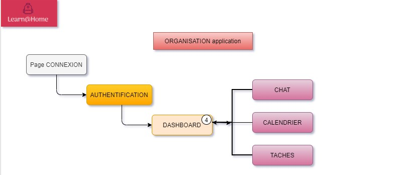

 

- - -

Learn@Home souhaite travailler avec nous sur toute la conception de son site web. 

Notre première étape est de bien définir les besoins client, avant de démarrer le développement logiciel pur. Nous avons prévu une nouvelle réunion dans quelques semaines, l’objectif est que tu leur présentes les éléments suivants : 

1/ Les diagrammes de cas d’usage pour chacune des fonctionnalités majeures de chaque page (connexion, chat, calendrier, gestionnaire de tâches, tableau de bord), pas besoin d’utiliser l’UML.

2/ Les user stories avec critère(s) d’acceptation pour chacune des fonctionnalités, partagées dans un format standard (PDF, DOCX, XLSX).

3/ Les maquettes du site avec un design simple et au moins une maquette par page (Figma ou Sketch) et  expliquer la navigation entre les pages pendant le meeting.  

4/ Un Kanban découpant le projet, de manière macro (détails techniques exclus) en blocs de fonctionnalités et sous-fonctionnalités pour le développement.

- - -

### Document : 
[note de réunion cliquez](https://s3-eu-west-1.amazonaws.com/course.oc-static.com/projects/Front-End+V2/P8+-+Gestion+de+projet/Notes+-+Re%CC%81union+Learn%40Home.pdf)

#### Kanban : 

[kanban cliquez](https://www.notion.so/Dev4U-projet-Learn-Home-d3382616521a48b582085b21c31c368d) 
- - -
###  Organisation Application - Schema 

  

- - -
#### 5 Pages : 
* Connexion -  son [User_stories](Documents/User_stories/us_connexion.pdf) - son [User_case](Documents/Use_cases/Use_case_connexion.jpg)
* Tableau de bord - son [User_stories](Documents/User_stories/us_dashboard.pdf) - son [User_case](Documents/Use_cases/Use_case_dashboard.jpg)
* Gestion des tâches - son [User_stories](Documents/User_stories/us_task.pdf) - son [User_case_student](Documents/Use_cases/Use_case_task_student.jpg) --- [User_case_tutor](Documents/Use_cases/Use_case_task_tutor.jpg)
* Calendrier - son [User_stories](Documents/User_stories/us_calendar.pdf) - son [User_case](Documents/Use_cases/Use_case_calendar.jpg)
* Interface de chat - son [User_stories](Documents/User_stories/us_chat.pdf) - son [User_case](Documents/Use_cases/Use_case_chat.jpg)

- - -

Liens : 
* projet Github Dev4U  [Mon projet P10 Learn@Home](https://github.com/pascalinecte91/Dev4U-P10)
* Maquette Figma Lear@Home [Maquettes cliquez](https://www.figma.com/file/KLzunXLhTLjXEQo0AtZ08p/Maquette-Dev4U?node-id=1%3A3&t=MwqU49YymqsugQ90-0)

### Livrables  attendus
- Un document PDF contenant les diagrammes de cas d’usage.
- Un document PDF contenant les user stories avec critère(s)d’acceptation.
- Un document PDF contenant les maquettes du site.
- Un document TXT contenant le lien vers le tableau Kanban (Notion, Trello, or GitHub).

- - -